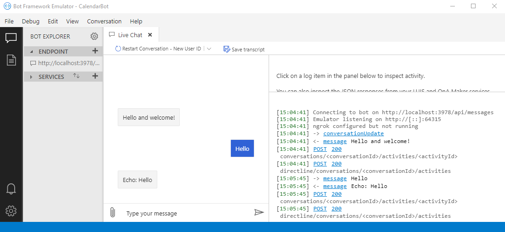

<!-- markdownlint-disable MD002 MD041 -->

<span data-ttu-id="016b0-101">このセクションでは、ボットフレームワークプロジェクトを作成します。</span><span class="sxs-lookup"><span data-stu-id="016b0-101">In this section you'll create a Bot Framework project.</span></span>

1. <span data-ttu-id="016b0-102">プロジェクトを作成するディレクトリで、コマンドラインインターフェイス (CLI) を開きます。</span><span class="sxs-lookup"><span data-stu-id="016b0-102">Open your command-line interface (CLI) in a directory where you want to create the project.</span></span> <span data-ttu-id="016b0-103">次のコマンドを実行して、 **EchoBot** テンプレートを使用して新しいプロジェクトを作成します。</span><span class="sxs-lookup"><span data-stu-id="016b0-103">Run the following command to create new project using the **Microsoft.Bot.Framework.CSharp.EchoBot** template.</span></span>

    ```dotnetcli
    dotnet new echobot -n GraphCalendarBot
    ```

    > [!NOTE]
    > <span data-ttu-id="016b0-104">エラーが表示された場合は、 `No templates matched the input template name: echobot.` 次のコマンドを使用してテンプレートをインストールし、前のコマンドを再度実行します。</span><span class="sxs-lookup"><span data-stu-id="016b0-104">If you receive an `No templates matched the input template name: echobot.` error, install the template with the following command and re-run the previous command.</span></span>
    >
    > ```dotnetcli
    > dotnet new -i Microsoft.Bot.Framework.CSharp.EchoBot
    > ```

1. <span data-ttu-id="016b0-105">既定の **EchoBot** クラスの名前を **calendarbot** に変更します。</span><span class="sxs-lookup"><span data-stu-id="016b0-105">Rename the default **EchoBot** class to **CalendarBot**.</span></span> <span data-ttu-id="016b0-106">**/Bots/EchoBot.cs** を開き、のすべてのインスタンスを置き換え `EchoBot` `CalendarBot` ます。</span><span class="sxs-lookup"><span data-stu-id="016b0-106">Open **./Bots/EchoBot.cs** and replace all instances of `EchoBot` with `CalendarBot`.</span></span> <span data-ttu-id="016b0-107">ファイルの名前を **CalendarBot.cs** に変更します。</span><span class="sxs-lookup"><span data-stu-id="016b0-107">Rename the file to **CalendarBot.cs**.</span></span>

1. <span data-ttu-id="016b0-108">`EchoBot` `CalendarBot` その他の **.cs** ファイルで、のすべてのインスタンスを置換します。</span><span class="sxs-lookup"><span data-stu-id="016b0-108">Replace all instances of `EchoBot` with `CalendarBot` in the remaining **.cs** files.</span></span>

1. <span data-ttu-id="016b0-109">CLI で、現在のディレクトリを **Graphcalendarbot** ディレクトリに変更し、次のコマンドを実行してプロジェクトのビルドを確認します。</span><span class="sxs-lookup"><span data-stu-id="016b0-109">In your CLI, change the current directory to the **GraphCalendarBot** directory and run the following command to confirm the project builds.</span></span>

    ```dotnetcli
    dotnet build
    ```

## <a name="add-nuget-packages"></a><span data-ttu-id="016b0-110">NuGet パッケージを追加する</span><span class="sxs-lookup"><span data-stu-id="016b0-110">Add NuGet packages</span></span>

<span data-ttu-id="016b0-111">に進む前に、後で使用する追加の NuGet パッケージをインストールします。</span><span class="sxs-lookup"><span data-stu-id="016b0-111">Before moving on, install some additional NuGet packages that you will use later.</span></span>

- <span data-ttu-id="016b0-112">[AdaptiveCards](https://www.nuget.org/packages/AdaptiveCards/) が、応答でアダプティブカードを送信することを許可します。</span><span class="sxs-lookup"><span data-stu-id="016b0-112">[AdaptiveCards](https://www.nuget.org/packages/AdaptiveCards/) to allow the bot to send Adaptive Cards in responses.</span></span>
- <span data-ttu-id="016b0-113">Bot にダイアログのサポートを[追加するためのダイアログ。](https://www.nuget.org/packages/Microsoft.Bot.Builder.Dialogs/)</span><span class="sxs-lookup"><span data-stu-id="016b0-113">[Microsoft.Bot.Builder.Dialogs](https://www.nuget.org/packages/Microsoft.Bot.Builder.Dialogs/) to add dialog support to the bot.</span></span>
- <span data-ttu-id="016b0-114">Bot プロンプトから返される TIMEX 式を **DateTime** オブジェクトに変換するための、 [Microsoft レコグナイザー exexpression](https://www.nuget.org/packages/Microsoft.Recognizers.Text.DataTypes.TimexExpression/) 。</span><span class="sxs-lookup"><span data-stu-id="016b0-114">[Microsoft.Recognizers.Text.DataTypes.TimexExpression](https://www.nuget.org/packages/Microsoft.Recognizers.Text.DataTypes.TimexExpression/) to convert the TIMEX expressions returned from bot prompts into **DateTime** objects.</span></span>
- <span data-ttu-id="016b0-115">[Microsoft.Graph](https://www.nuget.org/packages/Microsoft.Graph/): Microsoft Graph を呼び出すためのものです。</span><span class="sxs-lookup"><span data-stu-id="016b0-115">[Microsoft.Graph](https://www.nuget.org/packages/Microsoft.Graph/) for making calls to Microsoft Graph.</span></span>

1. <span data-ttu-id="016b0-116">CLI で次のコマンドを実行して、依存関係をインストールします。</span><span class="sxs-lookup"><span data-stu-id="016b0-116">Run the following commands in your CLI to install the dependencies.</span></span>

    ```Shell
    dotnet add package AdaptiveCards --version 2.2.0
    dotnet add package Microsoft.Bot.Builder.Dialogs --version 4.10.3
    dotnet add package Microsoft.Bot.Builder.Integration.AspNet.Core --version 4.10.3
    dotnet add package Microsoft.Recognizers.Text.DataTypes.TimexExpression --version 1.4.1
    dotnet add package Microsoft.Graph --version 3.18.0
    ```

## <a name="test-the-bot"></a><span data-ttu-id="016b0-117">Bot をテストする</span><span class="sxs-lookup"><span data-stu-id="016b0-117">Test the bot</span></span>

<span data-ttu-id="016b0-118">コードを追加する前に、bot をテストして正常に動作することを確認し、Bot フレームワークエミュレーターがテストするように構成されていることを確認します。</span><span class="sxs-lookup"><span data-stu-id="016b0-118">Before adding any code, test the bot to make sure that it works correctly, and that the Bot Framework Emulator is configured to test it.</span></span>

1. <span data-ttu-id="016b0-119">次のコマンドを実行して、ボットを開始します。</span><span class="sxs-lookup"><span data-stu-id="016b0-119">Start the bot by running the following command.</span></span>

    ```dotnetcli
    dotnet run
    ```

    > [!TIP]
    > <span data-ttu-id="016b0-120">プロジェクト内のソースファイルは、任意のテキストエディターを使用して編集できますが、 [Visual Studio Code](https://code.visualstudio.com/)を使用することをお勧めします。</span><span class="sxs-lookup"><span data-stu-id="016b0-120">While you can use any text editor to edit the source files in the project, we recommend using [Visual Studio Code](https://code.visualstudio.com/).</span></span> <span data-ttu-id="016b0-121">Visual Studio Code では、デバッグサポート、Intellisense などが提供されています。</span><span class="sxs-lookup"><span data-stu-id="016b0-121">Visual Studio Code offers debugging support, Intellisense, and more.</span></span> <span data-ttu-id="016b0-122">Visual Studio Code を使用している **場合は、[**  ->  **デバッグ開始**] メニューを使用して bot を開始できます。</span><span class="sxs-lookup"><span data-stu-id="016b0-122">If using Visual Studio Code, you can start the bot using the **Run** -> **Start Debugging** menu.</span></span>

1. <span data-ttu-id="016b0-123">Bot が実行中であることを確認するには、ブラウザーを開いてに進み `http://localhost:3978` ます。</span><span class="sxs-lookup"><span data-stu-id="016b0-123">Confirm the bot is running by opening your browser and going to `http://localhost:3978`.</span></span> <span data-ttu-id="016b0-124">Bot の準備ができたことが表示 **されます。**</span><span class="sxs-lookup"><span data-stu-id="016b0-124">You should see a **Your bot is ready!**</span></span> <span data-ttu-id="016b0-125">メッセージ。</span><span class="sxs-lookup"><span data-stu-id="016b0-125">message.</span></span>

1. <span data-ttu-id="016b0-126">Bot フレームワークエミュレーターを開きます。</span><span class="sxs-lookup"><span data-stu-id="016b0-126">Open the Bot Framework Emulator.</span></span> <span data-ttu-id="016b0-127">[ **ファイル** ] メニューを選択し、[Bot] を **開き** ます。</span><span class="sxs-lookup"><span data-stu-id="016b0-127">Choose the **File** menu, then **Open Bot**.</span></span>

1. <span data-ttu-id="016b0-128">`http://localhost:3978/api/messages` **BOT の URL** にを入力し、[**接続**] を選択します。</span><span class="sxs-lookup"><span data-stu-id="016b0-128">Enter `http://localhost:3978/api/messages` in the **Bot URL**, then select **Connect**.</span></span>

1. <span data-ttu-id="016b0-129">Bot が `Hello and welcome!` チャットウィンドウで応答します。</span><span class="sxs-lookup"><span data-stu-id="016b0-129">The bot responds with `Hello and welcome!` in the chat window.</span></span> <span data-ttu-id="016b0-130">Bot にメッセージを送信して、それがエコーバックすることを確認します。</span><span class="sxs-lookup"><span data-stu-id="016b0-130">Send a message to the bot and confirm it echoes it back.</span></span>

    
