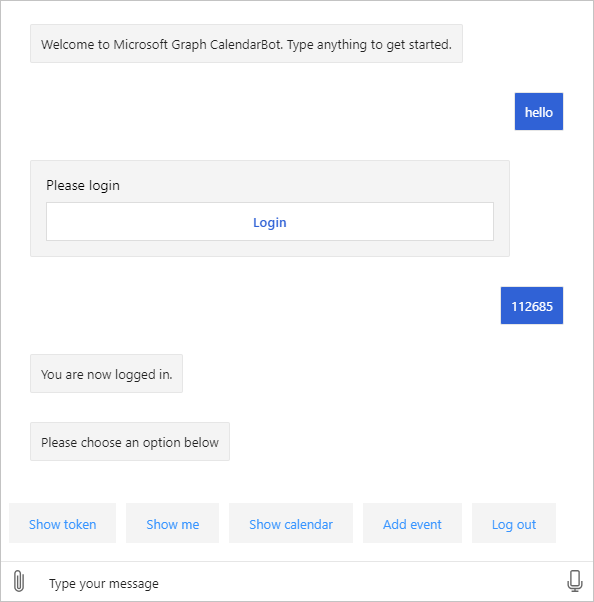

<!-- markdownlint-disable MD002 MD041 -->

この演習では、Bot に認証を実装するために Bot フレームワークの **Oauthprompt** を使用し、MICROSOFT Graph API を呼び出すためのアクセストークンを取得します。

1. **/appsettings.jsを** 開き、次のように変更します。

    - の値を、 `MicrosoftAppId` **グラフの予定表 Bot** アプリの登録のアプリケーション ID に変更します。
    - の値 `MicrosoftAppPassword` を **Graph Calendar Bot** クライアントシークレットに変更します。
    - という値を `ConnectionName` 持つ値を追加 `GraphBotAuth` します。

    :::code language="json" source="../demo/GraphCalendarBot/appsettings.example.json":::

    > [!NOTE]
    > `GraphBotAuth`Azure Portal の **OAuth 接続設定** でエントリの名前以外の値を使用した場合は、その値をエントリに使用し `ConnectionName` ます。

## <a name="implement-dialogs"></a>ダイアログを実装する

1. **ダイアログ** という名前のプロジェクトのルートに新しいディレクトリを作成します。 **LogoutDialog.cs** という名前のフォルダーに新しいファイルを作成し、次のコードを追加します **。**

    :::code language="csharp" source="../demo/GraphCalendarBot/Dialogs/LogoutDialog.cs" id="LogoutDialogSnippet":::

    このダイアログは、派生元の bot の他のすべてのダイアログの基本クラスを提供します。 これにより、ユーザーは bot のダイアログ内の場所に関係なく、ログアウトすることができます。

1. **MainDialog.cs** という名前のフォルダーに新しいファイルを作成し、次のコードを追加します **。**

    ```csharp
    using System.Collections.Generic;
    using System.Threading;
    using System.Threading.Tasks;
    using Microsoft.Bot.Builder;
    using Microsoft.Bot.Builder.Dialogs;
    using Microsoft.Bot.Builder.Dialogs.Choices;
    using Microsoft.Bot.Schema;
    using Microsoft.Extensions.Configuration;
    using Microsoft.Extensions.Logging;

    namespace CalendarBot.Dialogs
    {
        public class MainDialog : LogoutDialog
        {
            const string NO_PROMPT = "no-prompt";
            protected readonly ILogger _logger;

            public MainDialog(IConfiguration configuration, ILogger<MainDialog> logger)
                : base(nameof(MainDialog), configuration["ConnectionName"])
            {
                _logger = logger;

                // OAuthPrompt dialog handles the authentication and token
                // acquisition
                AddDialog(new OAuthPrompt(
                    nameof(OAuthPrompt),
                    new OAuthPromptSettings
                    {
                        ConnectionName = ConnectionName,
                        Text = "Please login",
                        Title = "Login",
                        Timeout = 300000, // User has 5 minutes to login
                    }));

                AddDialog(new ChoicePrompt(nameof(ChoicePrompt)));

                AddDialog(new WaterfallDialog(nameof(WaterfallDialog), new WaterfallStep[]
                {
                    LoginPromptStepAsync,
                    ProcessLoginStepAsync,
                    PromptUserStepAsync,
                    CommandStepAsync,
                    ProcessStepAsync,
                    ReturnToPromptStepAsync
                }));

                // The initial child Dialog to run.
                InitialDialogId = nameof(WaterfallDialog);
            }

            private async Task<DialogTurnResult> LoginPromptStepAsync(
                WaterfallStepContext stepContext,
                CancellationToken cancellationToken)
            {
                // If we're going through the waterfall a second time, don't do an extra OAuthPrompt
                var options = stepContext.Options?.ToString();
                if (options == NO_PROMPT)
                {
                    return await stepContext.NextAsync(cancellationToken: cancellationToken);
                }

                return await stepContext.BeginDialogAsync(nameof(OAuthPrompt), null, cancellationToken);
            }

            private async Task<DialogTurnResult> ProcessLoginStepAsync(
                WaterfallStepContext stepContext,
                CancellationToken cancellationToken)
            {
                // If we're going through the waterfall a second time, don't do an extra OAuthPrompt
                var options = stepContext.Options?.ToString();
                if (options == NO_PROMPT)
                {
                    return await stepContext.NextAsync(cancellationToken: cancellationToken);
                }

                // Get the token from the previous step. If it's there, login was successful
                if (stepContext.Result != null)
                {
                    var tokenResponse = stepContext.Result as TokenResponse;
                    if (!string.IsNullOrEmpty(tokenResponse?.Token))
                    {
                        await stepContext.Context.SendActivityAsync(
                            MessageFactory.Text("You are now logged in."), cancellationToken);
                        return await stepContext.NextAsync(null, cancellationToken);
                    }
                }

                await stepContext.Context.SendActivityAsync(
                    MessageFactory.Text("Login was not successful please try again."), cancellationToken);
                return await stepContext.EndDialogAsync();
            }

            private async Task<DialogTurnResult> PromptUserStepAsync(
                WaterfallStepContext stepContext,
                CancellationToken cancellationToken)
            {
                var options = new PromptOptions
                {
                    Prompt = MessageFactory.Text("Please choose an option below"),
                    Choices = new List<Choice> {
                        new Choice { Value = "Show token" },
                        new Choice { Value = "Show me" },
                        new Choice { Value = "Show calendar" },
                        new Choice { Value = "Add event" },
                        new Choice { Value = "Log out" },
                    }
                };

                return await stepContext.PromptAsync(
                    nameof(ChoicePrompt),
                    options,
                    cancellationToken);
            }

            private async Task<DialogTurnResult> CommandStepAsync(
                WaterfallStepContext stepContext,
                CancellationToken cancellationToken)
            {
                // Save the command the user entered so we can get it back after
                // the OAuthPrompt completes
                var foundChoice = stepContext.Result as FoundChoice;
                // Result could be a FoundChoice (if user selected a choice button)
                // or a string (if user just typed something)
                stepContext.Values["command"] = foundChoice?.Value ?? stepContext.Result;

                // There is no reason to store the token locally in the bot because we can always just call
                // the OAuth prompt to get the token or get a new token if needed. The prompt completes silently
                // if the user is already signed in.
                return await stepContext.BeginDialogAsync(nameof(OAuthPrompt), null, cancellationToken);
            }

            private async Task<DialogTurnResult> ProcessStepAsync(
                WaterfallStepContext stepContext,
                CancellationToken cancellationToken)
            {
                if (stepContext.Result != null)
                {
                    var tokenResponse = stepContext.Result as TokenResponse;

                    // If we have the token use the user is authenticated so we may use it to make API calls.
                    if (tokenResponse?.Token != null)
                    {
                        var command = ((string)stepContext.Values["command"] ?? string.Empty).ToLowerInvariant();

                        if (command.StartsWith("show token"))
                        {
                            // Show the user's token - for testing and troubleshooting
                            // Generally production apps should not display access tokens
                            await stepContext.Context.SendActivityAsync(
                                MessageFactory.Text($"Your token is: {tokenResponse.Token}"),
                                cancellationToken);
                        }
                        else if (command.StartsWith("show me"))
                        {
                            await stepContext.Context.SendActivityAsync(
                                MessageFactory.Text("I don't know how to do this yet!"),
                                cancellationToken);
                        }
                        else if (command.StartsWith("show calendar"))
                        {
                            await stepContext.Context.SendActivityAsync(
                                MessageFactory.Text("I don't know how to do this yet!"),
                                cancellationToken);
                        }
                        else if (command.StartsWith("add event"))
                        {
                            await stepContext.Context.SendActivityAsync(
                                MessageFactory.Text("I don't know how to do this yet!"),
                                cancellationToken);
                        }
                        else
                        {
                            await stepContext.Context.SendActivityAsync(
                                MessageFactory.Text("I'm sorry, I didn't understand. Please try again."),
                                cancellationToken);
                        }
                    }
                }
                else
                {
                    await stepContext.Context.SendActivityAsync(
                        MessageFactory.Text("We couldn't log you in. Please try again later."),
                        cancellationToken);
                    return await stepContext.EndDialogAsync(cancellationToken: cancellationToken);
                }

                // Go to the next step
                return await stepContext.NextAsync(cancellationToken: cancellationToken);
            }

            private async Task<DialogTurnResult> ReturnToPromptStepAsync(
                WaterfallStepContext stepContext,
                CancellationToken cancellationToken)
            {
                // Restart the dialog, but skip the initial login prompt
                return await stepContext.ReplaceDialogAsync(InitialDialogId, NO_PROMPT, cancellationToken);
            }
        }
    }
    ```

    このコードを確認してみてください。

    - コンストラクターでは、順序どおりに実行される一連の手順を含む [WaterfallDialog](https://docs.microsoft.com/azure/bot-service/bot-builder-concept-waterfall-dialogs?view=azure-bot-service-4.0) を設定します。
        - で `LoginPromptStepAsync` は、 **Oauthprompt** を送信します。 ユーザーがログインしていない場合は、UI プロンプトがユーザーに送信されます。
        - では `ProcessLoginStepAsync` 、ログインが成功したかどうかを確認し、確認を送信します。
        - ここでは、 `PromptUserStepAsync` 使用可能なコマンドを使用して **ChoicePrompt** を送信します。
        - これにより `CommandStepAsync` 、ユーザーの選択が保存され、 **Oauthprompt** が再送信されます。
        - では `ProcessStepAsync` 、受け取ったコマンドに基づいてアクションが実行されます。
        - では、 `ReturnToPromptStepAsync` ウォーターフォールが開始されますが、最初のユーザーログインをスキップするフラグが渡されます。

## <a name="update-calendarbot"></a>CalendarBot を更新する

次の手順では、これらの新しいダイアログを使用するように **Calendarbot** を更新します。

1. /Bots/CalendarBot.cs を開き、内容全体を次のコードで置き換えます **。**

    :::code language="csharp" source="../demo/GraphCalendarBot/Bots/CalendarBot.cs" id="CalendarBotSnippet":::

    変更の概要を次に示します。

    - **Calendarbot** クラスがテンプレートクラスに変更され、**ダイアログ** が受け取ります。
    - **Teamsactivityhandler** を拡張するように **calendarbot** クラスを変更し、Microsoft Teams でのサインインを許可しました。
    - 認証を有効にするためのメソッドオーバーライドを追加しました。

## <a name="update-startupcs"></a>Startup.cs の更新

最後の手順として、 `ConfigureServices` 認証に必要なサービスを追加するメソッドを更新し、[新規作成] ダイアログボックスを使用します。

1. **Startup.cs** を開き、 `services.AddTransient<IBot, Bots.CalendarBot>();` メソッドから行を削除します。 `ConfigureServices`

1. メソッドの最後に、次のコードを挿入 `ConfigureServices` します。

    :::code language="csharp" source="../demo/GraphCalendarBot/Startup.cs" id="ConfigureServiceSnippet":::

## <a name="test-authentication"></a>認証のテスト

1. すべての変更を保存し、を使用して bot を開始し `dotnet run` ます。

1. Bot フレームワークエミュレーターを開きます。 [ **ファイル** ] メニューの [ **新しい Bot 構成**] を選択します。

1. フィールドに次のように入力します。

    - **Bot 名:**`CalendarBot`
    - **エンドポイント URL:**`https://localhost:3978/api/messages`
    - **Microsoft アプリ id:** **Graph Calendar Bot** アプリの登録のアプリケーション id
    - **Microsoft アプリのパスワード:** 使用している **グラフの予定表ボット** クライアントのシークレット
    - **Bot 構成に格納されているキーを暗号化します。** い

    ![[新しいボット構成] ダイアログのスクリーンショット](images/new-bot-config.png)

1. [ **保存して接続**] を選択します。 エミュレーターを接続すると、 `Welcome to Microsoft Graph CalendarBot. Type anything to get started.`

1. 何らかのテキストを入力して bot に送信します。 Bot は、ログインプロンプトで応答します。

1. [ **ログイン** ] ボタンを選択します。 エミュレーターは、で始まる URL の確認を求めるメッセージを表示し `oauthlink://https://token.botframeworkcom` ます。 [ **確認** ] を選択して続行します。

1. ポップアップウィンドウで、Microsoft 365 アカウントを使用してログインします。 要求されたアクセス許可を確認し、同意します。

1. 認証と同意が完了すると、ポップアップウィンドウに検証コードが表示されます。 コードをコピーし、ウィンドウを閉じます。

    

1. [チャット] ウィンドウに検証コードを入力して、ログインを完了します。

    

1. [ **トークンの表示** ] ボタン (または種類) を選択すると、 `show token` bot にアクセストークンが表示されます。 [ **ログアウト] ボタン** (または入力) によって、ログアウト `log out` できます。

> [!TIP]
> Bot との会話を開始するときに、Bot フレームワークエミュレーターに次のエラーメッセージが表示されることがあります。
>
> ```text
> Failed to generate an actual sign-in link: Error: Failed to connect to ngrok instance for OAuth postback URL:
> FetchError: request to http://127.0.0.1:4041/api/tunnels failed, reason: connect ECONNREFUSED 127.0.0.1:4041
> ```
>
> この問題が発生した場合は、エミュレーターを閉じて再起動します。
